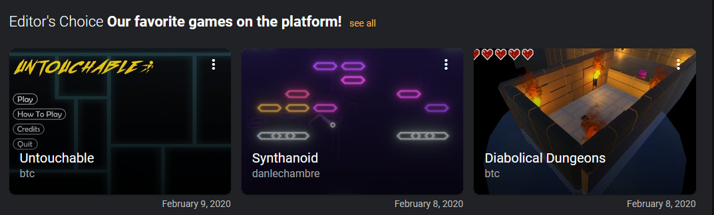

In the process of trying to organise my many hard drives into some sort of cohesive storage system I'd been digging around old projects. I stumbled upon a game I created back in early 2020 called Synthanoid. It was shortly after I'd left my career as an IT security guy, and was working towards doing dev as a job.

Anyone who's self-taught themselves anything knows it's all about staying motivated and engaged. So I decided that building games was going to be the best way to learn to program. In fact, if I could get away with being a penniless indie game dev, I probably would, alas, I like nice things (to my detriment I guess). In any case, this simple block-breaking game was the first complete thing I built.

When I stumbled across this project, it was in and amongst a dozen or so half-baked abandoned prototypes, so this one really stood out. What's particularly special about it to me, is it was done for no other reasons than for the fun of it, and to prove to myself that I could finish a project with no external motivation.

It took me a weekend and I created all the assets including the music, so it's a complete, original work (well aside from the completely stolen idea of course 😅). I even received an "Editor's Choice" on [Simmer](https://simmer.io).

I didn't manage it completely unaided. I basically watched the first section in [GameDev.TV's 'Learn Unity'](https://www.gamedev.tv) course and then went off and built it. If you follow _any_ kind of tutorial I'd always recommend you just watch it, take notes, and then build something on your own without referring back. It feels painful the first time you do it, but I guarantee you learn a lot more.

The project can be found on [Github](https://github.com/danlechambre/Synthanoid) and a ~~WebGL build of the game is still up on Simmer~~ Simmer be no more.
