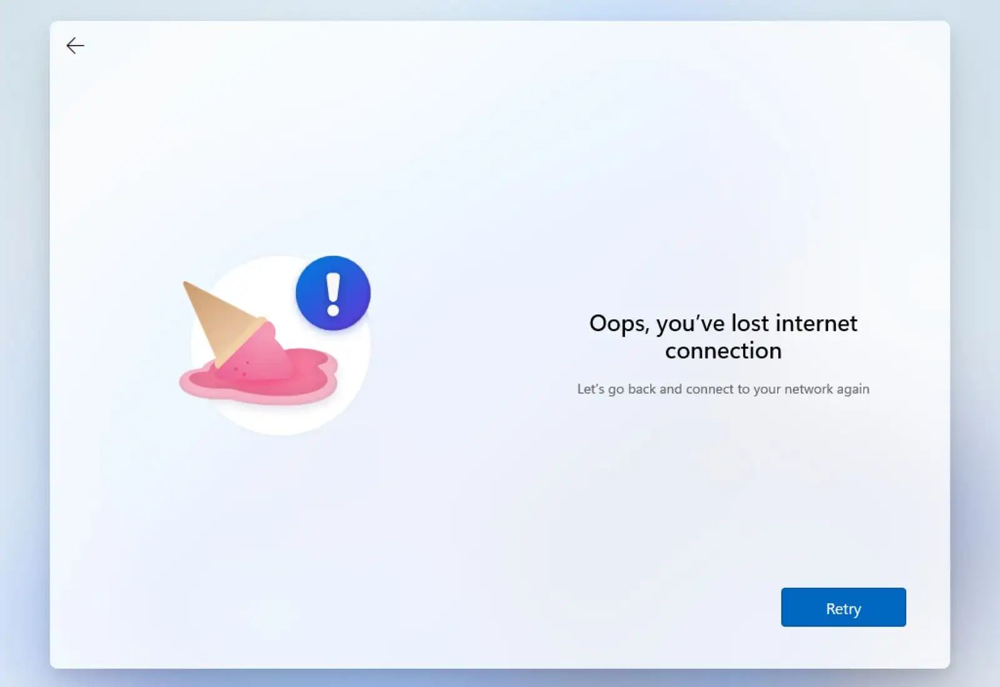

Wanted to write up using Powershell to set up a new Widows rig. Things to cover:

I've always put off setting up any kind of "dotfiles" or automated setup for my machines often thinking that the time it takes to set it all up far outweighs the time spent on the few occasions in my life I actually set up a machine. I thought this to be especially true on Windows given that there's usually been a couple of OS versions between each time I do it. I finally bit the bullet on Saturday having had to restore a machine I had not long since set up. All in all it has probably taken me longer than I'd spend if I added up the next half dozen installs, but I guess it was relatively fun to do.

If you've ever set up Windows 11 you'll know that the OOBE (Out Of Box Experience) is the worst. It asks you a ton of questions about tracking "Oh yes please Microsoft! Please take as much of my data as you are able for nothing in return!", tries to get you to buy M365, and tries to get you to sync your soul to OneDrive. This stage was actually what prompted this endeavour in the first place. On first search this seemed like an easy thing to achieve, just create an `unattend.xml`, otherwise known as an answer file, pop it on a USB, and start your machine. As far as I could gather you're supposed to create this file using the [Assessment and Deployment Kit](https://learn.microsoft.com/en-us/windows-hardware/get-started/adk-install). What it's supposed to do is read all of your answers to these questions from that file and take you straight into Windows. What happened for me is that I still got all of the questions, then the machine bricked on restart. Oh dear. Obviously should have paid closer attention to the ADK docs. For now, skipping OOBE is on the todo list.

It took me a fair while to get back to the starting point. Made more difficult by the fact my only other machine is a Mac, so creating a bootable Windows 11 drive was _very_ painful. Lucky for me the process is well [documented](https://gist.github.com/acarril/8c15f600cf0397dd61161a470f50f669).

After finally getting going again with a fresh Windows install I hit my next roadblock. Because I was no longer using the built-in recovery partition that came on the machine (I wrecked it remember?) all of the drivers were missing including for the Wifi card. What does Microsoft require for setting up a new computer these days? That's right, an internet connection. Lordy! I went off to find the driver pack provided by Beelink (another task that was far harder than it needed to be). I installed the driver for my wifi card but kept getting an error telling me I had no internet.

I knew for a fact that the wifi was actually working because this error occurred when entering my Microsoft account password, and the previous input was able to look up my email address. In any case I found several articles telling me what to do, but in the end I took the very unscientific approach of just trying over and over again. After half a dozen times it seemed to switch to a local account setup process (not something I'd found when searching the issue, so a worthwhile discovery).

Wow! So a few hours in and I'm finally ready to start.

The next step was to start to script the setup. I was certain this would be done with Powershell, which is not something I've used in a long time. I find this sort of thing a great use case for ChatGPT, it would be a waste of time sitting down to learn the basics of Powershell for this one-off project when I knew ChatGPT had a good chance of barfing out something understandable and relatively well explained.

The basic workflow I wanted to achieve was:

- Pull a script from GitHub to kick off the process
- Install all pending Windows updates
- Set any OS level preferences
- Remove all of the crapware that comes on a new install
- Install the set of apps I want on a Windows machine
- Set any app level preference

I've made a pretty good start towards this. The repo can be found at [danlechambre/windows-box-fresh](https://github.com/danlechambre/windows-box-fresh). There's a few issues still to work through such as starting a new Powershell session after certain tasks have completed, and a lot of config still needs to be added to the repo as I configure it on this install. And man, I'd really like to get that OOBE stage skipped.

There's a few other things I'd like it to take care of to that I'll try and add over the coming weeks:

- Get past that dang OOBE stage
- Get Edge to **not** ask for everything but my inside leg measurement
- Customise pinned taskbar apps
- Delete any desktop shortcuts created during the bootstrapping
- Set a wallpaper
- Add more OS prefs
  - Show hidden files
  - Show file extensions
